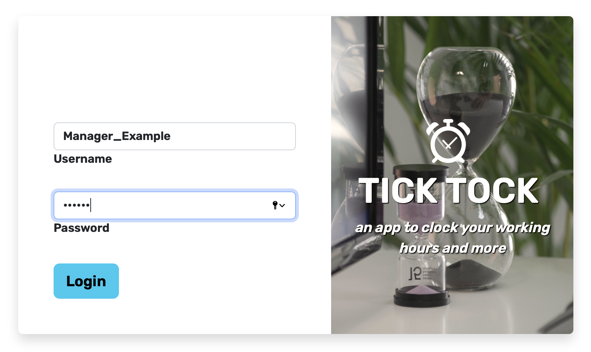
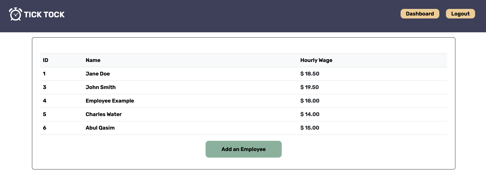

# TICK TOCK
[](https://opensource.org/licenses/MIT)
## Description
This application assists users to clock-in/out as a timesheet registy and allows managers to keep track of working schedules.
<!-- Work hours are then calculated with pay-rates (based on the authenticated user) to accurately display their pay-stub. -->
For better security and data breach prevention the architecture was built with intent for use on a local server environment.
<br /><br />


<br /><br />

## User Story:
In a company with multiple roles (ex. Manager, Accountant, Employee, etc) different data is generated and available for changes based on each role. With that in consideration, the following scope were kept in mind during development:

    AS an employee user, I WANT to have my work hours be tracked so that I can get paid accurately:
        -   So WHEN the application loads, a login screen is displayed
        -	WHEN I login a clock is displayed upon authentication, to record time of shift start/end
        -   THEN WHEN I click/punch CLOCK IN the clock counter starts
        -	WHEN I click/punch CLOCK OUT the counter stops and registers the current date, the start time and the end time
        -   THEN WHEN I click on DASHBOARD it displays a page with all my records up to date
<!-- Calculate total hours worked, and display total after summary of worked hours minus any mandatory off time (ex. Break, lunch, etc). -->

```sh
AS a manager user, I WANT to oversee all employee routines to ensure accurate time records and work efficiency:
    -	SO WHEN I login, the manager account is authenticated and displays a DASHBOARD with employees ID, NAME and HOURLY WAGES
    -   THEN I am able to click ADD AN EMPLOYEE to create a new employee in my DATABASE
    -   OR I can click one of the existing employees to get access to their entire timesheet report
    -   WHEN I click an employee record, THEN I can also edit this employee’s base information and timesheet
```

<br />



<br />

<!-- ```sh
As an accountant, I want to view total work hours/vacation hours used to calculate pay of all employees
-	After login, accountant account is authenticated to give access to pay rates and work hours
-	After punch, display page with overview of employee/team’s time sheet
``` -->
## Tech Stack:

- Node.js
- Express.js
- Handlebars.js
- Day.js
- Bootstrap
- MySQL
- Sequalize ORM
- Heroku

<br />

## Installation:
To install this application `clone` the repository, then `cd` into the root `PAY-DAY` folder and run:
```sh
npm i
```
Or use default answers by running the following command:
```sh
npm i -y
```
<br />

## How to use:
After the installation is complete do either one of the following options:

- Use case A:
    - Deploy the application to `Heroku` and test it live
- Use case B:
    - Ensure your `MySQL` server is running by executing `mysql -u root -p` from the command line
    - Use `mysql` command `SHOW DATABASES;` to ensure the database `pay_day_db` is created
    - Run `source db/schema.sql` from the CLI if you need to create the `pay_day_db` database
    - Execute `node seeds/seed.js` to populate the database with pre-defined testing data
    - Run `npm start` to load the application
    - From the web browser navigate to `http://localhost:3001/`
- Use case C:
    - If you do not want to download and install the application you can also navigate to: https://pay-day-schedule.herokuapp.com and run the currently <strong>[deployed application](https://pay-day-schedule.herokuapp.com)</strong>.

<br />

Regardless of the USE CASE picked, when prompted to `login` there are two pre-defined testing options to be used:

- Login as <strong>Manager</strong>:
    - Username: `Manager_Example`
    - Password: `111111`

<br />

- Login as <strong>Employee</strong>:
    - Username: `Employee_Example`
    - Password: `222222`

<br />

## Future Developments:
    - Add ability to have an Accountant user
    - Create feature to calculate and generate payroll reports by a set time range

<br />

<!-- ## Support
Please spam our professor's github and pressure him into giving us a perfect score on all of our projects (including this one)! Last day of class is <insert date>, so don't hesitate to show your support before then. -->
## Credits
- [Shu Yang](https://github.com/NewChap2022)
- [Rafael Gomes](https://github.com/rfabreu)
- [Charles (Dexter) Zacour](https://github.com/DexZax)
- [Arslan Tahir](https://github.com/tahir-arslan)
## License
Licensed under the MIT license.
